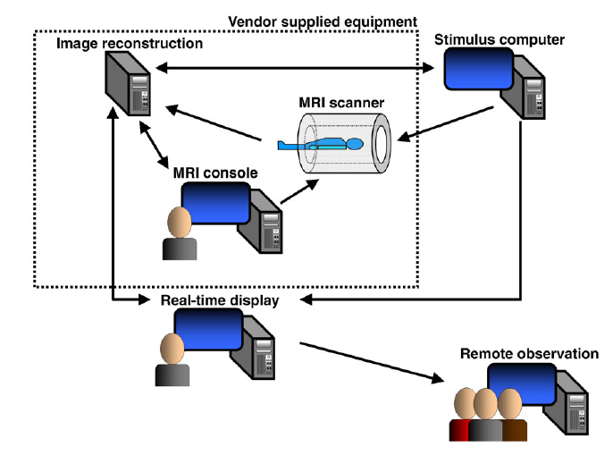

##Existing real-time fMRI implementations 

 There are a variety of ways one can extract fMRI information based on how the brain is responding during an experiment, and then
 use this information to change stimuli (neurofeedback) or controll brain computer interfaces (BCI).  
The majority of real-time fMRI has focused on the use of univariate statistical analysis approaches related to the general linear model
(GLM) [\(Friston et al., 1995b\)](http://spin.ecn.purdue.edu/fmri/PDFLibrary/FristonK_HBM_1995_2_189_210.pdf) or to tracking the 
fMRI signal in one or a few regions of interest (ROIs). However, there are also real-time fMRI approaches that predict brain-states for feedback using distributed brain-state patterns. In other words, it's an approach of brain reading rather than that of localized activation.

In this section we will walkthough the different ways of implementing real-time fMRI.

###1. [Univariate statistical approaches](#univariate_statistical_approaches)
#### [Region of Interest](#region_of_interest)
##### [TurboFire](#turbofire)
##### [Turbo-BrainVoyager](#turbo-brainvoyager)
##### [AFNI](#afni)
###2. [Multivariate statistical approaches](#multivariate_statistical_approaches)
#### [Brain state prediction realtime fMRI](#brain_state_prediction_realtime_fmri)
##### [Temporally Adaptive Brain State fMRI](#temporally_adaptive_brain_state_fmri)
##### [Multivariate and univariate realtime functional imaging](#multivariate_and_univariate_realtime_functional_imaging)

---

## Univariate statistical approaches

TurboFire, Turbo-BrainVoyager, and AFNI are fairly similar in their basic functionality.

These systems originated with the goal of processing data with a mass univariate approach.

## Region of Interest

#### TurboFire
#### Turbo-BrainVoyager

+ Very good visualization capabilities for browsing through voxel time series and
for 3D volume visualization.
+ Provides convenient support for GLM contrasts in real-time.
+ Updates an ROI file that can contain data for multiple ROIs and can be shared (e.g. over
SAMBA) and read by presentation software to generate displays, control BCI devices, etc. [(Weiskopf et al., 2004a ](http://ieeexplore.ieee.org/xpl/login.jsp?tp=&arnumber=1300789&url=http%3A%2F%2Fieeexplore.ieee.org%2Fxpls%2Fabs_all.jsp%3Farnumber%3D1300789)[,b)](http://www.sciencedirect.com/science/article/pii/S0928425705000239)

#### AFNI

+ Very good visualization capabilities for browsing through voxel time series and
for 3D volume visualization.
+ enables TCP and serial transmission of multiple ROIs as well as motion parameters.
## Multivariate or Brain state prediction real-time fMRI.

### Temporally Adaptive Brain State fMRI

 This part describes temporally adaptive brain-state (Also refered as **TABS**) prediction real-time fMRI from [LaConte et al. (2007, ](http://www.ncbi.nlm.nih.gov/pubmed/17133383)[ 2011)] (http://www.ncbi.nlm.nih.gov/pubmed/?term=Decoding+fMRI+brain+states+in+real-time+laConte)

#### Advantages
1. Multivariate approaches provide a principled method for dealing with distributed patterns of brain responses
  * when network activity is expected
  * when mental strategies could vary from individual to individual
  * or when one or a few ROIs are not unequivocally the most appropriate for the investigation
2. No prior assumptions about functional localization and individual performance strategies are required
  
  * the system learns these directly from the volunteer 
3. Feedback can rely on a direct, intuitive translation of brain state, rather than a representation based on
increasing or decreasing local activity
4. Near-perfect prediction accuracy (~80%) classifications attainable during sustained periods of activation
5. Stimulus feedback can respond to changes in the breain state mucha earlier than the time-to-peak limitations of the BOLD response

#### Characteristics

+ *"Brain states"* [(as in Strother et al., 2002b)](http://www.ncbi.nlm.nih.gov/pubmed/11906218) are essentially the sensory/behavioral events or 
mental processes for we might hope to find neural correlates through neuroimaging.
+ Algorithms usually used in machine learning attempt to estimate this relationship between vector inputs and scalar outputs. 
+ **TABS** uses brain volumes from temporally sampled data as vector inputs to a trained model, which then predicts the scalar outputs of brain states 
that are subsequently used as a control signal to adapt the feedback stimulus.
+ **TABS's** machine learning approach used with modern data acquisition and reconstruction capabilities of modern MRI systems, can allow for 
greater flexibility of fMRI experimental designs by enabeling adaptive stimuli guided by ongoing detection of the sensory/behavioral states encoded
 in the hemodynamics of a subjet's brain.  

+ Contrary to mass univariate contexts, where *"brain states"* are represented as variates of interest in a design matrix, in supervised machine
 learning contexts, these regressors serve instead as *"labels."* 

   When the labels are **categorical** in nature, we can formulate the modeling problem as a classification problem over a set of experimental
   categories. 

   When the labels are **continuous**, the problem can be framed as a regression problem to describe parametrically varying
   brain states such as task difficulty, behavioral rate, visual angle, etc. 

+ Multivatiate strategies provide a useful tool in situations where less a priori knowledge exists or subjects can use different cognitive strategies
to perform the same task because they have the potential to adapt to the individual and the specific experimental context.
 
+ Because *"brain states"*, in many cases, can be empirically observed (if you are a well trained actor and you think of something sad, you could even
drop some tears!) and the brain state prediction validated more easily than the statistical map predictions, it gives the oportunity to obtain a robust
training data set to estimate this multi voxel pattern analysis parameters for the supervised learning.
   
   TABS implementation represents an active system based on these concepts.     

+ Finally, it is important to remember that regardless of the analyses performed
   (supervised, unsupervised, multivariate, mass univariate), the source
   data are exactly the same and come with the same limitations inherent
   to fMRI (e.g. voxel size, temporal sampling, and an indirect
   relationship to cellular brain activity).  
 

 
### TABS implementation

**The equipment you will need to build an rtfMRI system as shown in Fig. 1:**

1. Depending on the vendor hardware and software architectures, you certainly need the scanner receiver A/D and image reconstruction hardware.
2. Access to the reconstruction system, which can range from a shared file system to custom reconstruction code that has direct access
to the data.
3. At least one additional computer dedicated to controlling the stimulus delivery and any desired behavioral or physiological recording and
the Audio/Video presentation sytem.
4. A second separate computer to run the real-time software (with shared file and/or network access) or be integrated
with (or even fully replace) the image reconstruction software.

**Making the actual connections between equipments:**

1. Will depend on the physical layout of the machines, local computer security policiesand, and the actual hardware on the computers, but include:
+ parallel
+ RS232 serial
+ firewire ports 
+ USB2 
+ Ethernet connections through switches support data communication through protocols such as TCP and hard disk file sharing through NFS and SAMBA. 
+ Bluetooth and/or wireless connections

 In the implementation reported by LaConte (2007), the image reconstruction system performed all of the
real-time calculations (estimating a classification model during training runs and using these models to classify new images during feedback runs)
 as well as communicating with
the stimulus computer. For real-time display, an additional computer running AFNI has since been added. 
For this to work, additional software was written to run on the image
reconstruction computer to send image data to the real-time display computer with TCP/IP, using AFNI's real-time plugin.
 This machine is currently also used for auxiliary
computations, such as generating brain vs. non-brain mask images, tracking motion, and updating brain maps. The real-time display computer 
can also act as a server for the remote
observation computer at a distant site. Future plans include transferring all of the real-time calculations to the real-time display computer 
to fully utilize AFNI's real-time
enhancements and our efforts to build plugins [(like 3dsvm)] (http://www.lacontelab.org/3dsvm.htm) for AFNI.

**Note** that these details, by their nature, are outdated quickly, however, the main concerns are that the processor power and data transmission 
bandwidth are adequate to perform whatever is needed for the experiment.  Image data requires the most RAM and/or disk utilization while BCI control signals from ROIs or classifiers usually
require only a few bytes. Furthermore, the TABS system for prediction of brain states uses a trained
model that is the same for every volume and thus, the computational demand remains fixed for the entire feedback run.

**Fig. 1** Schematic of a current TABS hardware setup in which arrows indicate the direction of communication, tanken from [LaConte et al. (2007)](http://www.ncbi.nlm.nih.gov/pubmed/17133383). 
The dotted box represents the relevant subsystems of a typical MRI system, which include the MRI scanner, console, and image reconstruction.
 

### Multivariate and univariate realtime functional imaging

[**MURFI**](http://mindhive.mit.edu/realtime/murfi#documentation) (multivariate and univariate real-time functional imaging) is a software package for real-time processing of 
functional brain images for neuroscience applications. At the moment murfi is fMRI-centric, but we plan to add support for other imaging modalities.

[**MURFI**](http://mindhive.mit.edu/realtime/murfi#documentation) has a wiki with all the documents, installation and usage already in plase, so please go to [**MURFI**](http://mindhive.mit.edu/realtime/murfi#documentation) to get all the necesary info. 

This is an open-source release of the MURFI platform (see LICENSE for details).

For using MURFI with Siemens scanners, a proprietary data transfer sequence can be obtained via a C2P agreement. 
Alternatively, for non-Siemens scanners or for your own Siemens functors, Murfi will accept data over TCPIP conformant with the following structured information:

[https://github.com/gablab/murfi2/blob/master/src/io/RtExternalSenderImageInfo.h](https://github.com/gablab/murfi2/blob/master/src/io/RtExternalSenderImageInfo.h)

If you use MURFI in your own research, please cite:

Oliver Hinds, Satrajit Ghosh, Todd W Thompson, Julie J Yoo, Susan Whitfield-Gabrieli, Christina Triantafyllou, John D E Gabrieli (2011) Computing moment-to-moment BOLD activation for real-time neurofeedback. Neuroimage 54: 1. 361-368 Jan

[http://dx.doi.org/10.1016/j.neuroimage.2010.07.060](http://dx.doi.org/10.1016/j.neuroimage.2010.07.060)

Funding

This project was partially funded by several sponsors:

DARPA
NIH
McGovern Institute Neurotechnology Development Grant