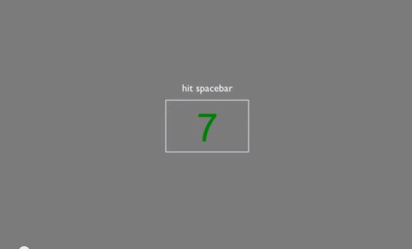

##Experiment Design ##

A great way to start your experiment design is through <a href="http://www.psychopy.org/">PsychoPy.</a>
  
  
<a href="http://www.psychopy.org/">PsychoPy</a>  is an open-source application to allow the presentation of stimuli and collection of data for a wide range of neuroscience, psychology and psychophysics experiments. It's a free, powerful alternative to Presentation(TM) or e-Prime(TM), written in Python (a free alternative to Matlab(TM) ).

For example it would be interesting to asses if the performance of your rt-fMRI paradigm has some impact of performance on a rapid visual information processing (RVIP) test for sustained attention conducted outside the scanner before and after.

__________________________

 Here are some usefull tests that you can use:
 
###Rapid Visual Information Processing (RVP)###
 
 Rapid Visual Information Processing (RVP) is a test of sustained attention (similar to the Continuous Performance Task) and has proved useful in many studies in which drugs are used to help develop a disease model. It is sensitive to dysfunction in the parietal and frontal lobe areas of the brain and is also a sensitive measure of general performance.
 
#### Task ####

A white box appears in the centre of the computer screen, inside which digits, from 2 to 9, appear in a pseudo-random order, at the rate of 100 digits per minute. Participants are requested to detect target sequences of digits (for example, 2-4-6, 3-5-7, 4-6-8) and to register responses using the press pad.

#### Outcome Measures ####
The nine RVP outcome measures cover latency, probabilities and sensitivity (calculated using Signal Detection Theory), and hits, misses, false alarms and rejections.

#### RVIP training example: ####

You can download the script here <a href="https://github.com/realtime-fmri-blog/realtime_code_examples/archive/master.zip">(RVIP)</a> or visit the  <a href="http://localhost/~bodhi/realtime-fmri-blog/_site//code.html">Code</a> section for more scripts. 

   
 

